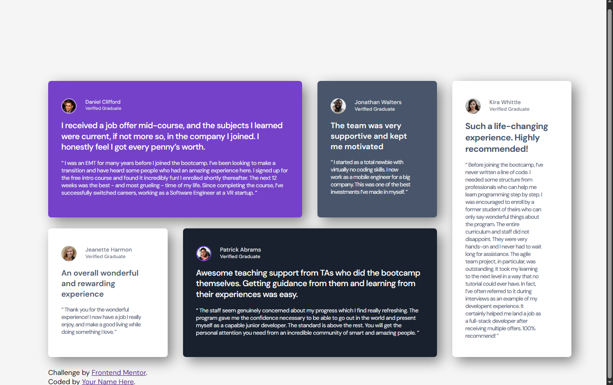

# Testimonials Grid Section

A responsive testimonials grid built with **HTML5** and **CSS3** as a solution to the Frontend Mentor challenge. The project focuses on building a clean, responsive layout using CSS Grid and Flexbox.

## 📖 Overview

This project recreates the Testimonials Grid Section challenge from Frontend Mentor. The primary goal was to strengthen my understanding of CSS Grid, responsive layouts, spacing, and typography.

## 📸 Preview



## 🎯 Challenge

Frontend Mentor Challenge:

https://www.frontendmentor.io/challenges/testimonials-grid-section-Nnw6J7Un7

## 📂 Repository

https://github.com/hatem-create/testimonials-grid

## 🛠️ Built With

- HTML5
- CSS3
- CSS Grid
- Flexbox
- Responsive Design
- Media Queries

## ✨ Features

- Responsive desktop and mobile layout
- CSS Grid page layout
- Flexbox for card content alignment
- Semantic HTML structure
- Clean and organized CSS

## 📚 What I Learned

During this project I improved my understanding of:

- Creating complex layouts with CSS Grid
- Combining Grid and Flexbox effectively
- Building responsive designs using media queries
- Managing spacing and typography
- Structuring CSS for better readability

## 📁 Project Structure

```text
.
├── images/
├── index.html
├── style.css
├── preview.png
└── README.md
```

## 🔮 Future Improvements

- Reduce repeated CSS by creating reusable classes
- Improve accessibility
- Refactor colors and spacing using CSS custom properties
- Continue improving code organization

## 👤 Author

**Hatem**

- GitHub: https://github.com/hatem-create
- Frontend Mentor: https://www.frontendmentor.io/profile/hatem-create

## 🙏 Acknowledgements

Challenge by **Frontend Mentor**.
